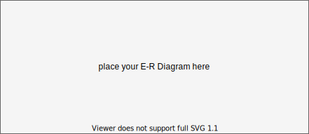

# Exam 1

Update the solution contents of this file according to [the instructions](instructions/instructions.md).

## Solutions

The following sections contain a report on the solutions to each of the required components of this exam.

### Data munging

The code in the Python program, [solution.py](solution.py), contains the solutions to the **data munging** part of this exam.

### Spreadsheet analysis

The spreadsheet file, [wifi.xslx](data/wifi.xslx), contains the solutions to the **spreadsheet analysis** part of this exam. In addition, the formulas used in that spreadsheet are indicated below:

1. Total number of free Wi-Fi hotspots in NYC

```
Place your formula here.
```

2. Number of free Wi-Fi hotspots in each of the 5 boroughs of NYC.

```
Place your formulas here - one on each line.
```

3. Number of free Wi-Fi hotspots provided by the LinkNYC - Citybridge in each of the zip codes of Manhattan.

```
Place your formula for just the zip code 10001 here.
```

4. The percent of all hotspots in Manhattan that are provided by LinkNYC - Citybridge.

```
Place your formula here.
```

### SQL queries

This section shows the SQL queries that you determined solved each of the given problems.

1. Write two SQL commands to create two tables named `hotspots` and `populations`.

```sql
Place your first command here.
```

```sql
Place your second command here.
```

2. Import the data in the `wifi.csv` and `neighborhood_populations.csv` CSV files into these two tables.

```sql
Place your first command(s) here.
```

```sql
Place your second command(s) here.
```

3. Display the five zip codes with the most Wi-Fi hotspots and the number of Wi-Fi-hotspots in each in descending order of the number of Wi-Fi-hotspots.

```sql
Place your query here.
```

4. Display a list of the name, location, and zip code for all of the free Wi-Fi locations provided by `ALTICEUSA` in Bronx, in descending order of zip code.

```sql
Place your query here.
```

5. Display the names of each of the boroughs of NYC, and the number of free Wi-Fi hotspots in each.

```sql
Place your query here.
```

6. Display the number of wifi hotspots in Bay Ridge, Brooklyn along with the population of Bay Ridge, Brooklyn.

```sql
Place your query here.
```

7. Display the number of **Free** wifi hotspots in each of the 5 NYC boroughs, along with the population of each borough.

```sql
Place your query here.
```

8. Display the names of each of the neighborhoods in which there exist Wi-Fi hotspots, but for which we do not have population data.

```sql
Place your query here.
```

9. Write an additional SQL query of your choice using Sqlite with this table; then describe the results

Write a description of the query here.

```sql
Place your query here.
```

### Normalization and Entity-relationship diagramming

This section contains responses to the questions on normalization and entity-relationship diagramming.

1. Is the data in `wifi.csv` in fourth normal form?

```
Enter your response here
```

2. Explain why or why not the `wifi.csv` data meets 4NF.

```
Enter your response here
```

3. Is the data in `neighborhood_populations.csv` in fourth normal form?

```
Enter your response here
```

4. Explain why or why not the `neighborhood_populations.csv` data meets 4NF.

```
Enter your response here
```

5. Use [draw.io](https://draw.io) to draw an Entity-Relationship Diagram showing a 4NF-compliant form of this data, including primary key field(s), relationship(s), and cardinality.


